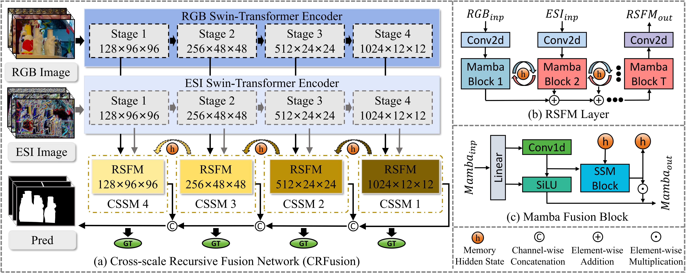
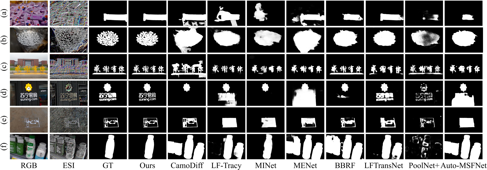
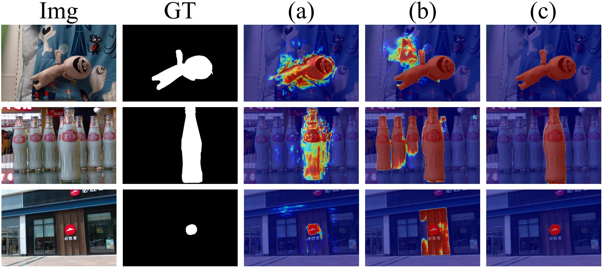

# Dynamic Memory-Driven Recursive Cross-Scale Fusion Network for Light Field Salient Object Detection (Submitted to AAAI2026)

# <span style="color: red; font-size: 1.5em;">We sincerely thank all reviewers !</span>

<div align="center">

</div>
An overview of the proposed CRFusion. (a) CRFusion is a light-field feature fusion framework that explicitly facilitates cross-domain semantic integration and ensures multi-scale consistency. (b) Architecture of the Recursive Semantic Fusion Module (RSFM). (c) Architecture of the Mamba Fusion Block.

<br>
4D light field data contains rich spatial and angular information, providing a more comprehensive feature representation for Salient Object Detection (SOD). However, the inherent structural disparities between the spatial and angular domains introduce a semantic gap during the fusion process, presenting significant challenges in effectively modeling cross-domain semantic complementarity and ensuring multi-scale semantic consistency. To address this, we propose a Cross-scale Recursive Fusion network (CRFusion), which introduces Mamba dynamic memory as the semantic bridge for cross-domain fusion, recursively fusing spatial and angular information across multi-scale spaces. The key design of CRFusion is the Recursive Semantic Fusion Module (RSFM), which leverages the hidden states of Mamba as dynamic memory to perform effective recursive fusion across domains, thereby capturing the semantic complementarity between the spatial and angular domains. In addition, we propose the Cross-scale Semantic Sensing Modeling (CSSM) mechanism, which stacks RSFM across multiple scales. It utilizes dynamic memory as a semantic bridge to model semantic consistency across multi-scale space. Extensive experiments on the DUTLF-V2 and PKULF datasets validate the effectiveness of our method in facilitating cross-domain semantic complementarity and ensuring multi-scale semantic consistency, achieving outstanding performance compared to state-of-the-art methods.

## Preparations
### 1. DUTLF-V2 & PKU-LF Datasets
DUTLF-V2: https://github.com/DUT-IIAU-OIP-Lab/DUTLF-V2

PKU-LF: https://openi.pcl.ac.cn/OpenDatasets/PKU-LF

After unzipping the downloaded files, for convenience, I recommand to organizing them in this style.

``` bash
DUTLF-V2/
├── Train/
│    ├── train_array_No_augmentation
│    ├── train_ESI
│    └── train_masks
└── Test/
     ├── test_images
     ├── test_ESI
     └── test_masks

PKU-LF/
├── all-focus-image/
│    ├── train
│    └── test
├── ESI/
│    ├── train
│    └── test
└── annotation/
     └── object/
            ├── train
            └── test
```

### 2. Create and activate conda environment
``` bash
cd "CRFusion root path"
conda create --name crfusion python=3.6.12
conda activate crfusion
pip install -r requirments.txt
```
### 3. Modify the config
``` bash
(1) data.py: Your data path
(2) train.py: Your pretrained pth file path
```
### 4. Train
To start training, just run the following code.
``` bash
python train.py
```
### 5. Inference
To inference, first modify the inference model path "pth_root" in test.py

Then, run the following code:
``` bash
python test.py
```
### 5. Evaluation metric
The evaluation metric results are generated using a uniform evaluation code: https://github.com/lartpang/PySODEvalToolkit.

To ensure a fair and accurate evaluation of our work, the prediction saliency maps of competing methods are generated using their published code. The saliency map results predicted by our model are available in the [`repo/Results`](./Results/) directory. 

<br>

<div align="center">

</div>
Visualization of qualitative analysis results, illustrating performance in scenarios involving similar object interference, complex backgrounds, and fine-grained segmentation.
<div align="center">
<br>

</div>
Comparison of response map visualizations for different component applications. Here, (a) shows response maps of the RSFM, (b) shows response maps of the CSSM, (c) shows response maps of the CRFusion.